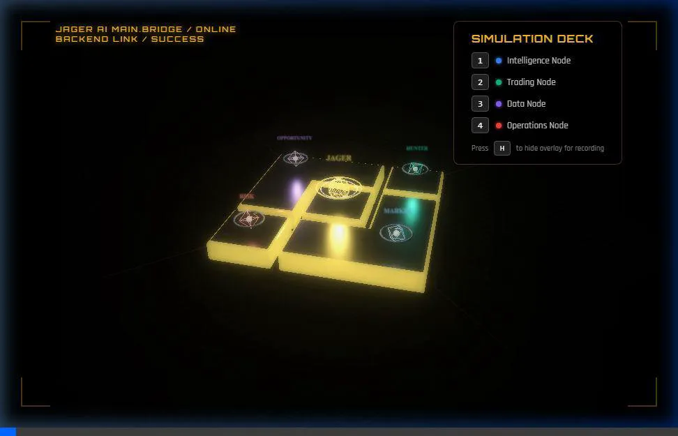

# 🐺 JAGER AI — Intelligence Agent for the Binance Ecosystem

> *Every BNB is made of JAGER. Every good decision is made of small insights.*

[](https://python.org)
[](https://telegram.org)
[](https://github.com/openclaw)
[](https://binance.com)

---

**Built for the OpenClaw x Binance Social Contest**  
*Interface demo: Telegram bot + 3D command-center prototype*

**An OpenClaw-compatible AI intelligence assistant for the Binance ecosystem.**

## Contest Submission Snapshot

- **Project Name:** JAGER AI
- **Category:** Smart Operations / Marketing & Education / Product Optimization
- **Interface:** Telegram + 3D command-center prototype
- **Core Functions:** Scam detection, Binance product discovery, market pulse, risk warnings
- **Stack:** Python, Anthropic API, Binance public endpoints

---

## The Name

**JAGER** was one of the earliest Binance Angels — a community figure whose name became synonymous with the idea of a very small, fundamental unit of BNB, similar to how *Satoshi* is the smallest unit of Bitcoin.

One JAGER = `0.00000001 BNB`.

This project embraces that metaphor: just as many small JAGER form the value of BNB, many small insights form better decisions for crypto users.

**JAGER AI is the intelligence layer that delivers those insights.**

---

## What It Does

JAGER AI is designed to help users interact more intelligently and safely with the Binance ecosystem. By adhering to agentic design patterns, it serves as a robust reconnaissance node.

### Four Core Intelligence Modules

| Module | Function |
|--------|----------|
| 🔴 **Threat Hunter** | Detects scams, phishing, seed phrase requests, impersonation |
| 💰 **Opportunity Hunter** | Surfaces Binance products relevant to your goals (live BNB price) |
| 📡 **Market Hunter** | Delivers narrative-level market intelligence from public data |
| ⚠️ **Risk Hunter** | Flags dangerous trading behavior with educational warnings |

---

## Demo

```
User: Someone from Binance support asked me for my seed phrase.

JAGER AI:
🚨 Threat Hunter — CRITICAL RISK DETECTED

🔴 CRITICAL — Seed Phrase / Private Key Request

What you should know:
• Binance staff will never ask for your seed phrase or private keys.
• Binance support contacts you through official channels only.
• Report this at support.binance.com.
```

```
User: I hold BNB. What can I do with it?

JAGER AI:
🎯 Opportunity Hunter

💰 BNB Price: $612.45 📈 +2.3% (24h)

🌱 Binance Launchpool
   Stake BNB to farm newly listed tokens for free.
   🔗 https://launchpool.binance.com

💰 Simple Earn
   Earn 1–8% APR on your BNB, flexible or locked.
   🔗 https://www.binance.com/en/earn

⛓️ BNB Chain Staking
   Delegate BNB to validators to earn staking rewards.
   🔗 https://www.bnbchain.org/en/staking
```

---

## Visual Command Center

As part of the intelligence suite, JAGER AI includes a **Cinematic 3D Mission Control** interface (`demo_interface_3d.html`). 

<p align="center">
  
</p>

This command center connects directly to the Python backend via WebSockets, allowing you to watch the JAGER AI agents (Threat, Market, Risk, Opportunity) coordinate in real-time on a holographic Binance-themed command ship while interacting via Telegram.

---

## Architecture

```
User Message (Telegram)
        │
        ▼
   OpenClaw Compatible
      Intent Router
        │
   ┌────┴─────────────────────────────┐
   │                                  │
   ▼                                  ▼
Local Pattern Matching          Claude AI (Anthropic)
(Threat / Risk Hunter)          (General Intelligence)
        │                              │
        ▼                              │
 Binance Public API ◄──────────────────┘
 (Opportunity / Market Hunter)
        │
        ▼
 Structured Response (Telegram + 3D Command Center WS)
```

- **No API key required** for Binance data — 100% public endpoints only
- **No database** — lightweight, runs on any machine
- **No GPU** — runs on any laptop including older hardware
- **Per-chat conversation memory** — context-aware responses

---

## Quick Start

### Requirements

- Python 3.11+
- A Telegram Bot Token (from [@BotFather](https://t.me/BotFather))
- An Anthropic API Key

### Installation

```bash
# Clone the repository
git clone https://github.com/kaizenbnb/JAGER-AI.git
cd JAGER-AI

# Create a virtual environment (recommended)
python -m venv venv
source venv/bin/activate  # Windows: venv\Scripts\activate

# Install dependencies
pip install -r requirements.txt

# Configure environment
cp .env.example .env
# Edit .env and add your TELEGRAM_BOT_TOKEN and ANTHROPIC_API_KEY
```

### Running (including older/low-spec laptops)

```bash
python main.py
```

That's it. The bot starts polling Telegram immediately.

---

## Project Structure

```
JAGER-AI/
├── main.py                    # Core agent + Telegram/WebSocket orchestrator
├── config.py                  # Environment & settings
├── demo_interface_3d.html     # Cinematic 3D Visual Command Center
├── demo_interface.html        # 2D Backup Interface
├── submission_text.md         # OpenClaw x Binance Application Form
├── .env.example
├── demo/
│   ├── README.md              # Demonstration Script
│   └── screenshots/           # Hackathon visual assets
├── prompts/
│   └── system_prompt.txt      # Agent identity & OpenClaw alignment
├── tools/
│   ├── threat_hunter.py       # Scam detection (pattern-based)
│   ├── opportunity_hunter.py  # Product discovery (live price)
│   ├── risk_hunter.py         # Trading risk education
│   └── market_hunter.py       # Narrative market intelligence
├── utils/
│   └── binance_public.py      # Binance public API wrapper
└── assets/
    └── logo.png
```

---

## Why this matters for Binance

- **Safer users:** Instant pattern-based threat detection protects users from scams and phishing attempts.
- **Better product discovery:** Contextual, goal-based suggestions guide users to Launchpool, Earn, and Staking appropriately.
- **Simpler market education:** Translates chaotic market data into clear narrative summaries.
- **Smarter risk awareness:** Educational warnings flag dangerous setups (e.g., max leverage on volatile assets) before execution.

JAGER AI demonstrates how AI agents can become an intelligent interface layer between users and the complexity of modern crypto ecosystems.

---

## Roadmap

- [ ] Portfolio analytics module
- [ ] Narrative sentiment tracking via social APIs
- [ ] Multi-language support
- [ ] Webhook deployment mode (production)
- [ ] BNB Chain on-chain activity monitoring

---

## Technical Notes

- All Binance data uses **public API endpoints only** — no personal API key, zero account risk
- Threat Hunter uses **local pattern matching** + LLM fallback — honest about its approach
- Market Hunter uses **live candlestick + ticker data** for real context, not hardcoded narratives
- Opportunity Hunter matches user goals to products using **keyword scoring**

---

## License

MIT License — see [LICENSE](LICENSE)

---

*Every BNB is made of JAGER. Every good decision is made of small insights.*
